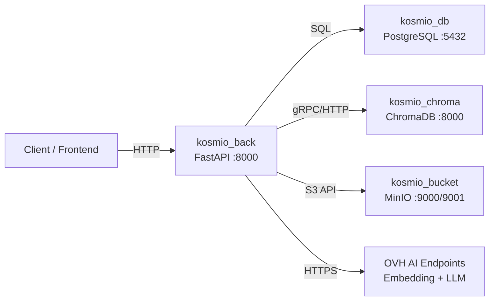
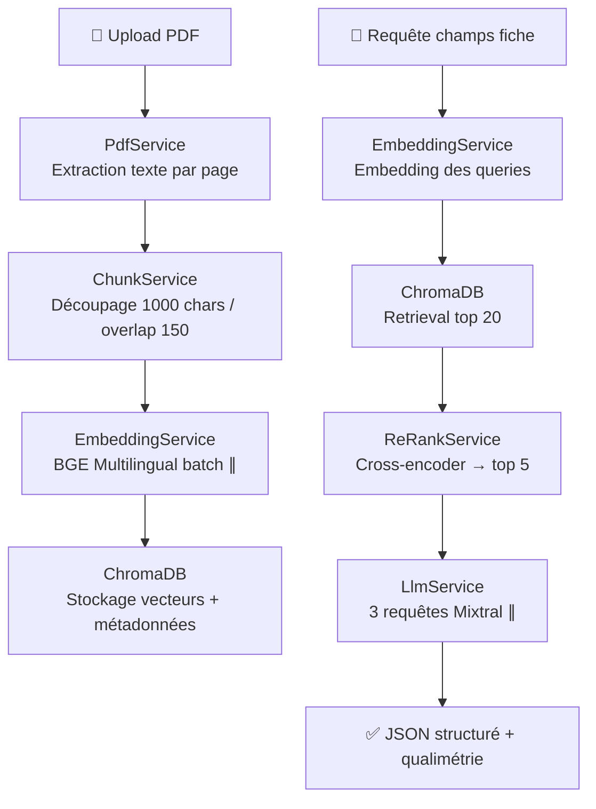

# 🌿 ProjetKosmio — Backend

> **Proof of Concept** — Pipeline RAG (Retrieval-Augmented Generation) pour la génération automatique de fiches **solutions** et **secteurs** au format JSON structuré à partir de documents PDF.

---

## 📖 Introduction

ProjetKosmio Backend est une API développée avec **FastAPI** qui permet d'ingérer des documents PDF, d'en extraire les informations clés, et de générer automatiquement des fiches structurées (solutions techniques et secteurs industriels) conformes au format wikiCO2.

Le système repose sur un **pipeline RAG complet** :

1. **Extraction** du contenu textuel depuis les PDF (PyPDF2)
2. **Chunking** intelligent avec chevauchement (LangChain)
3. **Embedding** multilingue parallélisé (BGE Multilingual Gemma2 via OVH AI Endpoints)
4. **Stockage** vectoriel persistant (ChromaDB)
5. **Retrieval & Re-ranking** en deux étapes (recherche vectorielle + cross-encoder FlashRank)
6. **Génération** structurée par LLM avec JSON Schema (Mixtral 8x7B via OVH AI Endpoints)
7. **Qualimétrie** automatique (taux de complétion + score de confiance via logprobs)

---

## 🛠️ Stack technique

| Composant | Technologie | Version / Détail |
|---|---|---|
| **Langage** | Python | 3.11 |
| **Framework API** | FastAPI + Uvicorn | — |
| **Base de données relationnelle** | PostgreSQL | 15 |
| **Base de données vectorielle** | ChromaDB | latest (persistante, authentifiée par token) |
| **Stockage d'images** | MinIO (S3-compatible) | — |
| **Conteneurisation** | Docker & Docker Compose | — |
| **Chunking** | LangChain (`RecursiveCharacterTextSplitter`) | chunk_size=1000, overlap=150 |
| **Embedding** | BGE Multilingual Gemma2 (OVH AI Endpoints) | batch parallélisé (ThreadPoolExecutor) |
| **Re-ranking** | FlashRank (`ms-marco-MiniLM-L-12-v2`) | cross-encoder local |
| **LLM** | Mixtral-8x7B-Instruct-v0.1 (OVH AI Endpoints) | temperature=0, JSON Schema enforced |
| **Driver BDD** | psycopg2-binary | — |

---

## 📁 Structure du projet

```
ProjetKosmioBack/
├── docker-compose.yml              # Orchestration des 4 services
├── docker-compose.override.yml     # Hot-reload pour le développement
├── Dockerfile                      # Image Python 3.11-slim
├── requirements.txt                # Dépendances Python
├── .env.example                    # Template des variables d'environnement
│
└── src/main/
    ├── run.py                      # Point d'entrée, lance Uvicorn
    │
    ├── config/
    │   ├── config.json             # URLs des modèles OVH, paramètres LLM
    │   └── logging_config.py       # Système de logging centralisé
    │
    ├── constant/
    │   ├── rag_constant.py         # Paramètres RAG (chunk size, queries, top_k...)
    │   └── llm_constant.py         # Prompts système pour le LLM
    │
    ├── controller/
    │   └── controller.py           # Routes FastAPI (10 endpoints)
    │
    ├── model/
    │   ├── config.py               # Modèle de configuration
    │   ├── extract_data.py         # Wrapper des données extraites
    │   ├── process_data.py         # Données post-traitement (page_content + metadata)
    │   ├── fiche_data.py           # Modèle de fiche
    │   ├── structure_solution_pour_llm.py  # JSON Schema Pydantic (solutions)
    │   └── structure_secteur_pour_llm.py   # JSON Schema Pydantic (secteurs)
    │
    └── service/
        ├── fiches_service.py                # Orchestrateur principal du pipeline RAG
        ├── document_service/
        │   ├── base_service.py              # Classe abstraite de traitement
        │   └── pdf_service.py               # Extraction et traitement des PDF
        ├── chunk_service/
        │   └── chunk_service.py             # Découpage en chunks (LangChain)
        ├── embedding_service/
        │   └── embedding_service.py         # Embedding batch parallélisé (OVH API)
        ├── database_vect_service/
        │   └── database_vect_service.py     # CRUD ChromaDB + retrieval avec re-ranking
        ├── rerank_service/
        │   └── rerank_service.py            # Re-ranking cross-encoder (FlashRank)
        ├── llm_service/
        │   ├── llm_service.py               # Appels Mixtral + assemblage JSON final
        │   └── qualimetrie.py               # Taux de complétion & confiance
        ├── bdd_service/
        │   └── bdd_service.py               # Service PostgreSQL (CRUD fiches)
        └── bucket_service/
            └── bucket_service.py            # Service MinIO (gestion d'images)
```

---

## ⚙️ Architecture Docker

Le projet utilise **4 conteneurs** orchestrés par Docker Compose :



---

## 🔄 Pipeline RAG



---

## 🚀 Prérequis

- **Git**
- **Docker** & **Docker Compose**
- **Clé API OVH AI Endpoints** (pour l'embedding et le LLM)

---

## Installation

### 1. Cloner le projet

```bash
git clone git@github.com:TrappyMadz/ProjetKosmioBack.git
cd ProjetKosmioBack
```

### 2. Configurer les variables d'environnement

```bash
cp .env.example .env
```

Éditez le fichier `.env` et renseignez vos valeurs :

```ini
# Ports d'accès (modifiables si conflit)
BACKEND_APP_PORT=8000
BACKEND_DB_PORT=5432
CHROMA_HOST_PORT=5435

# Base de données PostgreSQL
POSTGRES_USER=my_pg_user
POSTGRES_PASSWORD=my_pg_password
POSTGRES_DB=kosmio_db

# Clés API (obligatoire)
OVH_API_KEY=votre_clé_ovh

# ChromaDB
CHROMA_TOKEN=my_chroma_token

# MinIO (stockage d'images)
BUCKET_API_PORT=9000
BUCKET_CONSOLE_PORT=9001
MINIO_ROOT_USER=minio_user
MINIO_ROOT_PASSWORD=minio_password

# Frontend
FRONTEND_PORT=5173

```

### 3. Lancer l'application

```bash
docker compose up --build
```

> 💡 Ajoutez `-d` pour lancer en arrière-plan.

---

## 🌐 Accès aux services

| Service | URL |
|---|---|
| **API Backend** (Swagger UI) | `http://localhost:BACKEND_APP_PORT/docs` |
| **PostgreSQL** | `localhost:BACKEND_DB_PORT` |
| **ChromaDB** | `localhost:CHROMA_HOST_PORT` |
| **MinIO Console** | `http://localhost:BUCKET_CONSOLE_PORT` |

---

## 📡 Endpoints API

| Méthode | Route | Description |
|---|---|---|
| `GET` | `/` | Health check |
| `POST` | `/process_solution` | Upload PDF → génère une fiche solution JSON |
| `POST` | `/process_sector` | Upload PDF → génère une fiche secteur JSON |
| `GET` | `/fiche/solution` | Liste toutes les fiches solutions |
| `GET` | `/fiche/sector` | Liste toutes les fiches secteurs |
| `GET` | `/fiche/{id}` | Récupère une fiche par son ID |
| `PUT` | `/fiche/{id}` | Met à jour une fiche existante |
| `GET` | `/fiche/{id}/history` | Historique des versions d'une fiche |
| `POST` | `/fiche/{id}/image` | Upload d'une image associée à une fiche |
| `DELETE` | `/fiche/{id}/image/{id_img}` | Supprime une image d'une fiche |

---

## 🧪 Mode développement

Le fichier `docker-compose.override.yml` active automatiquement le **hot-reload** :
- Le code source est monté en volume dans le conteneur
- Toute modification d'un fichier `.py` redémarre automatiquement le serveur

---

## 🔧 Commandes utiles

```bash
# Arrêter les conteneurs
docker compose down

# Voir les logs en temps réel
docker compose logs -f

# Reconstruire après modification du Dockerfile ou des dépendances
docker compose up --build
```

---

## ⚠️ Troubleshooting

### `ConnectionError: Max retries exceeded`

Cette erreur survient lorsque l'API d'embedding OVH est saturée par trop d'appels simultanés. Le service d'embedding intègre un système de **retry avec backoff exponentiel** et un **rate limiter** (Semaphore), mais si le problème persiste :

- Réduisez le `max_workers` dans `embedding_bge_multilingual_batch` (défaut : 10)
- Réduisez le `rate_limit` (défaut : 20)
- Attendez quelques secondes avant de relancer

### ChromaDB non accessible

Vérifiez que le `CHROMA_TOKEN` dans votre `.env` correspond bien à celui configuré dans le docker-compose. Le client ChromaDB utilise une authentification par token.

---

## 📄 Licence

Projet interne — Usage restreint.
